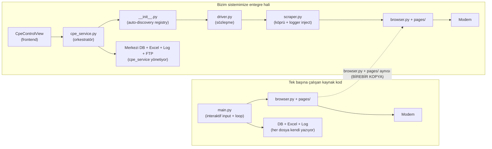

# CPE Driver Entegrasyon Kilavuzu

Bu doküman, bağımsız olarak geliştirilmiş modem otomasyon kodlarının bizim ana sistemimize nasıl entegre edildiğini anlatır. Hangi dosyaların aynen kullanıldığını, hangilerinin yeniden yazıldığını, hangilerinin atıldığını ve yeni bir modem eklemek isteyen birinin neyi nasıl yapması gerektiğini açıklar.

## 1. Neden iki katman?

Kaynak kod, tek başına çalışan bir Python uygulamasıdır: kendi `main.py`'si, kendi DB yazıcısı, kendi Excel üreticisi, kendi logger'ı vardır. Bizim sistemimizde ise Excel/DB/FTP/log yönetimi merkezi olarak `cpe_service.py` tarafından yapılır; driver'ın işi sadece modemi açmak ve veri çekmektir. Bu nedenle kaynak koddaki tarayıcı kontrol kısmı (selenium ile modem arayüzünde gezinen bölüm) aynen alınır, üstüne ince bir **adapter** katmanı yazılır. Böylece kaynak modüllere dokunmadan bizim sözleşmemize uyumlu hale gelir.

## 2. Tek başına çalışan kaynak kod (`<MODEM>/` klasörü)

Tipik bir kaynak klasörün içeriği:

| Dosya | Görev |
|---|---|
| `browser.py` | Modem arayüzünü açar, login olur, SIM/gizlilik/şifre değiştirme pop-up'larını geçer |
| `pages/` | Her modem sayfası için ayrı scraper (wan, system, wifi, traffic, dhcp) |
| `main.py` | Kullanıcıdan döngü sayısı/aralık/marka/model/firmware alır, sonsuz döngüde veri toplar |
| `config.py` | Chrome options, DB bağlantı bilgileri |
| `database.py` | PostgreSQL'e satır yazar |
| `excel.py` | xlsx dosyasını başlatır ve her tur satır ekler |
| `logger.py` | Dosya + konsol logger'ı kurar |
| `test.py` | Elle deneme yapmak için kullanılan dosya |

Çalıştırma şekli: `python main.py` &rarr; terminal soruları &rarr; sonsuz döngü &rarr; her turda Excel'e satır + DB'ye satır. Tek başına bilgisayarda çalışır, frontend yok.

## 3. Bizim sisteme entegre hali ([backend/app/cpe_drivers/&lt;modem&gt;/](.))

Entegre klasörün içeriği:

| Dosya | Durum |
|---|---|
| `browser.py` | **Birebir kopya** (kaynak dosya aynen) |
| `pages/` | **Birebir kopya** (klasör + içindeki tüm scraper'lar aynen) |
| `scraper.py` | **Yeni yazıldı** &mdash; köprü katmanı |
| `driver.py` | **Yeni yazıldı** &mdash; sözleşmeye bağlanan adapter |
| `__init__.py` | **Yeni yazıldı** &mdash; boş dosya, Python paketi olduğunu söyler |

Atılan dosyalar ve nedenleri:

| Atılan | Neden atıldı |
|---|---|
| `main.py` | Döngü/aralık/marka-model/firmware'i artık frontend topluyor, orkestratör `cpe_service.py` yönetiyor |
| `config.py` | Chrome options ve DB bilgileri merkezi `config/settings.py`'de |
| `database.py` | DB yazımını orkestratör yapıyor &mdash; tek tablo, tek format |
| `excel.py` | Excel üretimini orkestratör yapıyor &mdash; tek şablon, tek isimlendirme |
| `logger.py` | Logger merkezi `logger.py`'den kuruluyor, dosyalar tek yerde toplanıyor |
| `test.py` | Manuel deneme dosyası, prod'da yeri yok |

## 4. Adapter Pattern

Dört dosya, dört iş yapar:

### [base.py](base.py) &mdash; Sözleşme
`FRONTEND_KEYS` listesi (frontend'in `CpeControlView.vue`'da tanımladığı tüm parametre anahtarları) ve `KEY_LABELS` sözlüğü (Excel başlık etiketleri) burada. Ayrıca her driver'ın açması gereken sembolleri tanımlar:

- `BRAND: str`
- `MODEL: str`
- `connect(driver, modem_ip)` &rarr; modem arayüzünü açar, login + pop-up'ları geçer
- `get_device_info(driver)` &rarr; (yazılım, donanım, seri) tuple
- `collect(driver, secilen)` &rarr; `{anahtar: değer}` sözlüğü

### [\_\_init\_\_.py](__init__.py) &mdash; Auto-discovery registry
`cpe_drivers/` altındaki her klasörü tarar, içinde `driver.py` varsa otomatik yükler. `BRAND` ve `MODEL` sembollerine bakarak `(BRAND, MODEL) &rarr; modül` sözlüğü oluşturur. `get_driver(brand, model)` çağrısı bu sözlükten doğru modülü döndürür. **Hiçbir kayıt satırı yazmaya gerek yok**; klasörü açtığında sistem tanır.

### `driver.py` &mdash; Kontrat
Her modem için bir tane. `BRAND`, `MODEL` sabitlerini açar, `connect`/`get_device_info`/`collect` fonksiyonlarını yazar. İçinde tarayıcı koduyla ilgili detay yoktur; sadece `scraper.py`'deki fonksiyonları sırasıyla çağırır ve `secilen` set'ine göre hangi alanları döneceğine karar verir. Örnek: [g5b2/driver.py](g5b2/driver.py).

### `scraper.py` &mdash; Köprü
Kaynak `browser.py` ve `pages/` modülleri her fonksiyona `logger` parametresi bekler (örn. `LOGINPANEL(driver, logger)`). Bizim driver'ımız tek argümanla çalışacak şekilde tasarlandı. Köprü tam burada devreye girer: scraper modülün başında bir `logging.getLogger("cpe.&lt;modem&gt;")` üretir, sonra kaynak fonksiyonları `_lp(driver, _log)` gibi sarmalar. Bu sayede kaynak modüllere **tek satır dokunmuyoruz**. Örnek: [g5b2/scraper.py](g5b2/scraper.py).

## 5. Veri akışı (bir test koştuğunda)

1. Frontend (`CpeControlView.vue`) &rarr; `POST /cpe/start` (parametre seçimi, modem IP, marka, model, döngü, aralık)
2. `cpe_service.py` isteği alır, Chrome WebDriver'ı başlatır
3. `get_driver(brand, model)` çağrısı &mdash; registry doğru modülü bulup verir
4. `driver.connect(selenium_driver, modem_ip)` &mdash; modem arayüzü açılır, login geçilir
5. İlk turda `driver.get_device_info(...)` &mdash; yazılım/donanım/seri alınır
6. Her tur: `driver.collect(selenium_driver, secilen)` &rarr; sözlük döner
7. `cpe_service.py` sözlüğü Excel'e yazar, DB'ye yazar, log dosyasını günceller
8. Test bittiğinde orkestratör Excel dosyasını ve log dosyasını FTP'ye gönderir

Driver hiçbir zaman dosya açmaz, DB bağlantısı kurmaz, FTP'ye dokunmaz. Tek işi tarayıcıyı sürmek ve veri döndürmek.

## 6. Yeni modem eklemek (adım adım)

1. `backend/app/cpe_drivers/&lt;modem_adi&gt;/` klasörü aç (küçük harf, alt çizgi)
2. Kaynak `browser.py` dosyasını ve `pages/` klasörünü **aynen kopyala** (içine dokunma)
3. `scraper.py` yaz &mdash; [g5b2/scraper.py](g5b2/scraper.py)'yi şablon al, import isimlerini ve logger adını değiştir
4. `driver.py` yaz &mdash; [g5b2/driver.py](g5b2/driver.py)'yi şablon al; `BRAND`, `MODEL`, `connect`, `get_device_info`, `collect` doldur
5. Boş `__init__.py` koy
6. Bitti. Backend yeniden başlatıldığında registry otomatik tanır, frontend dropdown'unda görünür

Hiçbir yere kayıt satırı eklemek gerekmez. `list_supported()` çağrısı da yeni modemi otomatik döndürür.

## 7. Mimari Şema

## 8. Hangi modemler entegre, hangisi değil

### Entegre olanlar (18 modem)

| # | Klasör | # | Klasör |
|---|---|---|---|
| 1 | [arc_vlax1800](arc_vlax1800/) | 10 | [g5b2](g5b2/) |
| 2 | [archerc5v](archerc5v/) | 11 | [h1601p](h1601p/) |
| 3 | [dn8045x6_20](dn8045x6_20/) | 12 | [h1601p_h1601](h1601p_h1601/) |
| 4 | [dx3300_t1](dx3300_t1/) | 13 | [h168a](h168a/) |
| 5 | [eb810v](eb810v/) | 14 | [h298a](h298a/) |
| 6 | [eg620](eg620/) | 15 | [h3600_h3600p](h3600_h3600p/) |
| 7 | [ex20v](ex20v/) | 16 | [lg8245x6](lg8245x6/) |
| 8 | [ex3301_t0](ex3301_t0/) | 17 | [vc220](vc220/) |
| 9 | [ex3501_t0](ex3501_t0/) | 18 | [ex520v](ex520v/) |

### Atlanan modemler

| Klasör | Neden atlandı |
|---|---|
| `VX231` | Kaynak kodda `browser.py` ve `pages/` yok, kod yarım kalmış |
| `WR854GVR` | Kaynak kodda `browser.py` ve `pages/` yok, kod yarım kalmış |

Bu iki modem için temel selenium iskeleti tamamlandığında entegrasyon yukarıdaki adımlarla yapılabilir; ek bir mimari iş gerektirmez.
